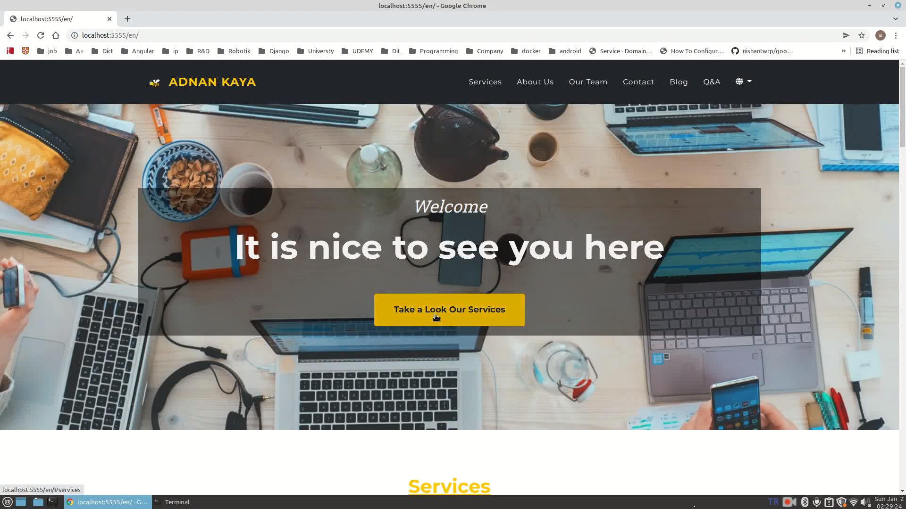

## Development Python Operations
```bash
python manage.py collectstatic
# Internationalization
python manage.py makemessages --all --ignore=venv
python manage.py compilemessages
# existence user profile creating
python manage.py create_profiles
```
---

## Demo video

[](https://www.youtube.com/watch?v=nEFGCNF6uYQ)

---
#### Resources
- https://github.com/BlackrockDigital/startbootstrap
- https://github.com/PacktPublishing/Django-3-by-Example
